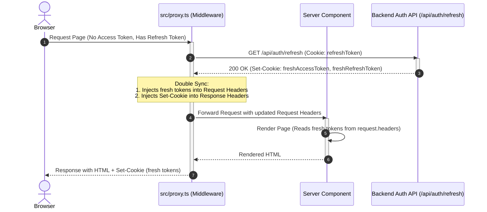
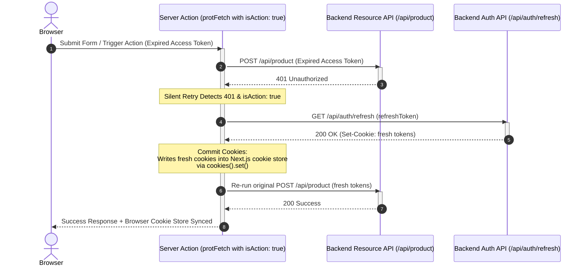
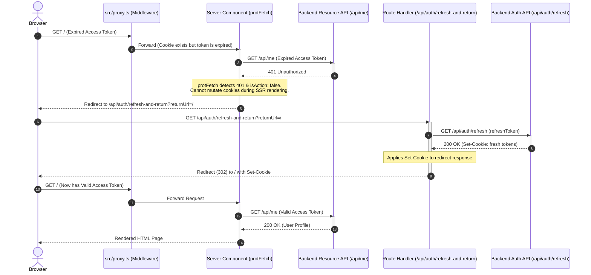

# Next.js 16 Unified Session Management & SDK Gateway

This repository houses a state-of-the-art authentication and session restoration architecture designed specifically for **Next.js 16.2.9**, **React 19.2**, and **Turbopack**. 

At the center of this project is the **`AuthService` SDK**, a custom-built, dependency-free library located in `src/lib`. The system solves Next.js's native "Cookie Write-Only" restriction inside Server Components, ensuring zero-flicker UI updates, silent session recovery, and resilient file/form actions with zero data loss.

---

## 🛠️ Tech Stack & Key Conventions

- **Framework**: Next.js 16.2.9 (Dynamic by default; caching is opt-in via `use cache`).
- **Render Engine**: React 19.2 (Stable Server Actions and View Transitions).
- **Bundler**: Turbopack (default for dev and builds).
- **Network Boundary**: `src/proxy.ts` (replaces deprecated `middleware.ts`). Runs on the **full Node.js Runtime**, enabling the use of native Node modules and arbitrary npm packages.
- **Styling**: TailwindCSS v4 with PostCSS.
- **Testing**: Node.js native test runner (`node:test`) and assertion engine (`node:assert`).

---

## 🏗️ The Three-Layer Session Protection Architecture

Next.js divides its execution environment into contexts with different cookie mutation rights:
1. **Proxy / Network Boundary (`src/proxy.ts`)**: Can inspect and modify incoming request headers and outgoing response headers.
2. **Server Actions & Route Handlers**: Full read and write access to the cookie store using `cookies().set()`.
3. **Server Components (SSR Page Rendering)**: Strictly **Read-Only** context; attempting to call `cookies().set()` throws a runtime exception.

To handle these boundaries cleanly, the `AuthService` orchestrates a three-layer protection strategy:

```
┌─────────────────────────────────────────────────────────────────────────┐
│                           Incoming Request                              │
└────────────────────────────────────┬────────────────────────────────────┘
                                     │
                                     ▼
                    ┌─────────────────────────────────┐
                    │     Layer 1: Proactive Proxy    │
                    │   (Double Sync & Token Refresh) │
                    └────────────────┬────────────────┘
                                     │
                 ┌───────────────────┴───────────────────┐
                 ▼                                       ▼
       [Server Actions / Routes]                [Server Components (SSR)]
   ┌───────────────────────────────┐        ┌───────────────────────────────┐
   │     Layer 2: Silent Retry     │        │  Layer 3: Reanimator Fallback │
   │  Direct Cookie Write + Retry  │        │ Redirect-Bounce via GET Route │
   └───────────────────────────────┘        └───────────────────────────────┘
```

---

### Layer 1: Proactive Gateway (The Double Sync Pattern)

Executed in `src/proxy.ts` (Middleware boundary). It rotates tokens before the page starts rendering if the access token has expired but a valid refresh token exists.

- **The Problem**: If a proxy rotates a token, only the outgoing response (`Set-Cookie`) gets updated. The current rendering thread (rendering the Server Components for the active request) would still read the expired/missing cookie from the original request, causing a `401 Unauthorized` during SSR.
- **The Solution (Double Sync)**: When `AuthService.getAuthorizedResponse` completes a successful refresh, it syncs the new tokens in two places:
  1. **Request Headers (`Cookie`)**: Injected directly so the current execution context (the Server Components) reads the fresh tokens immediately.
  2. **Response Headers (`Set-Cookie`)**: Injected into the browser response so the client stores the new cookies for subsequent requests.

#### Double Sync Flow:


---

### Layer 2: Silent Retry (Server Actions & Route Handlers)

Executed during state mutations (such as file uploads or database updates) where a user redirect would interrupt the flow and cause permanent loss of input data.

- **The Problem**: If a token expires during a file upload in a Server Action, executing a page-level redirect aborts the HTTP connection, discarding the file payload.
- **The Solution (Direct Commit)**: When `protFetch` is called with `{ isAction: true }`, it intercepts `401 Unauthorized` errors and heals the session in place:
  1. It triggers `AuthService.refresh()` using the stored refresh token.
  2. It writes the new tokens directly to the cookie store via `cookies().set()` (which is legal inside Server Actions).
  3. It automatically re-executes the original network request using the new credentials.

#### Silent Retry Flow:


---

### Layer 3: Reanimator Fallback (Server Component Rendering Safety Net)

Acts as a fail-safe fallback during Server Component rendering (SSR) if an unauthenticated request somehow gets past the proxy layer or hits a resource-level expiration.

- **The Problem**: If a Server Component hits a `401 Unauthorized` while fetching data, it cannot call `cookies().set()` because cookie mutation is strictly forbidden during React rendering.
- **The Solution (Reanimator Route)**: The network client (`protFetch`) throws a redirect to `/api/auth/refresh-and-return?returnUrl=[CurrentURL]`:
  1. The route handler `/api/auth/refresh-and-return` is a GET endpoint (where cookie mutations *are* legal).
  2. It performs the token rotation and commits the updated cookies using `NextResponse`.
  3. It bounces (redirects) the browser back to the origin `returnUrl`, where the page renders successfully on the second try.

#### Reanimator Fallback Flow:


---

## 🛑 Cookie Synchronization Pitfalls Solved

During development, we resolved four major pitfalls common to Next.js authentication architectures:

1. **The "Half-Sync" Failure**: Triggering a refresh inside Middleware updates the browser (`Set-Cookie` in response), but fails to update the request headers. The immediately following React rendering cycle reads the expired cookies from the incoming request, triggering a 401 error. *Fixed in Layer 1 via Double Sync.*
2. **The Swallowed Redirect**: Surrounding Server Actions with blind `try/catch` blocks intercepts Next.js's internal routing signals. Since `redirect()` works by throwing a special `NEXT_REDIRECT` error, swallowing it prevents the router from navigating. *Fixed by checking `if (e?.digest?.startsWith('NEXT_REDIRECT')) throw e;` in catch blocks.*
3. **The Refresh Storm**: Concurrent requests hitting an expired session at the same time can cause a race condition, where multiple calls attempt to rotate the same refresh token concurrently. The first rotation invalidates the old token, causing subsequent calls to fail. *Fixed by handling de-duplication on the backend side or via static instance promises.*
4. **The Action Interruption**: Triggering a standard browser redirect during a `POST` file upload interrupts the upload, causing loss of form state. *Fixed in Layer 2 by running an in-place fetch retry, bypassing redirects entirely.*

---

## 🔗 Client Component Support (The API Bridge Pattern)

Because authentication cookies are marked `HttpOnly` for security, Client Components (`"use client"`) cannot access token strings or initiate raw authentication requests. 

To bridge this gap, Client Components route requests through an internal Next.js Route Handler (acting as a proxy bridge) which delegates to `protFetch` with `isAction: true`:

```typescript
// 1. Create a Proxy Bridge Route Handler (src/app/api/proxy/route.ts)
import { NextRequest, NextResponse } from "next/server";
import { AuthService } from "@/lib";

export async function POST(req: NextRequest) {
    const data = await req.json();
    
    // Call protFetch with isAction: true. 
    // If tokens expire, they will be refreshed and committed on the server.
    const res = await AuthService.protFetch("/api/backend-endpoint", {
        method: "POST",
        body: data,
        isAction: true
    });

    if (!res.ok) {
        return NextResponse.json({ error: "Failed to process request" }, { status: res.status });
    }

    const payload = await res.json();
    return NextResponse.json(payload);
}
```

This bridge allows Client Components to execute requests seamlessly:
```typescript
// 2. Execute fetch from Client Component (src/components/MyClientComponent.tsx)
"use client";

export default function MyClientComponent() {
    const handleSubmit = async () => {
        const response = await fetch("/api/proxy", {
            method: "POST",
            body: JSON.stringify({ item: "value" }),
        });
        const data = await response.json();
        console.log("Response data:", data);
    };

    return <button onClick={handleSubmit}>Send Request</button>;
}
```

---

## 🎨 Diagnostic Logs Reference

The SDK includes a color-coded logging system built with ANSI codes to simplify debugging. In the terminal, look for the following prefixes:

| Prefix | Color | Context | Meaning |
| :--- | :--- | :--- | :--- |
| `[Proxy]` | **Yellow** | `src/proxy.ts` | Tracks entry, public/private route validation, and routing decisions. |
| `[AUTH]` | **Green** | `AuthService` | Logged during Double Sync, cookie commits, and middleware validation. |
| `[FETCH-START]` | **Default** | `AuthService.protFetch` | Logged when a resource request is initiated. Shows the request path and parameters. |
| `[FETCH-AUTH]` | **Green** | `AuthService.protFetch` | Logged when an in-action token rotation succeeds and retries the call. |
| `[FETCH-ERROR]` | **Red** | `AuthService.protFetch` | Logged when a request fails with 401 and begins a recovery attempt or redirect. |
| `[FETCH-FINISH]` | **Default** | `AuthService.protFetch` | Logged upon successful completion of a fetch request, showing HTTP status. |
| `[REFRESH-START]` | **Green** | `AuthService.refresh` | Logged when the low-level fetch request to the rotation backend begins. |
| `[REFRESH-ERROR]` | **Red** | `AuthService.refresh` | Logged when the token rotation fails (e.g., timeout, abort, or 401 response). |
| `[REFRESH-FINISH]` | **Green** | `AuthService.refresh` | Logged when token rotation succeeds, confirming receipt of raw cookies. |
| `[REANIMATOR-START]` | **Default** | `AuthService.handleRefreshAndReturn` | Logged when the fallback redirect bounce endpoint is hit. |
| `[REANIMATOR-FINISH]`| **Green** | `AuthService.handleRefreshAndReturn` | Logged when the fallback endpoint completes rotation and redirects back. |
| `[REANIMATOR-ERROR]` | **Red** | `AuthService.handleRefreshAndReturn` | Logged when the fallback endpoint fails to rotate tokens and forces a logout. |
| `[SignInAction]` | **Magenta** | `src/app/sign-in/actions.ts` | Tracks credentials validation and initial session commits. |
| `[SignOut]` | **Red** | `src/app/api/auth/sign-out/route.ts` | Tracks session destruction and redirect to the sign-in page. |

---

## ⚙️ Environment Variables

Create a `.env` file in the **project root** (it is git-ignored). The following keys are required:

| Variable | Description | Example |
| :--- | :--- | :--- |
| `API_URL` | Base URL of the backend API. All `protFetch` requests are prefixed with this value. | `http://localhost:4400` |

```env
API_URL=http://localhost:4400
```

---

## 🚀 Execution & Verification

### Running the Dev Server
Launch Turbopack in development mode:
```bash
npm run dev
```

### Running Unit Tests
The unit test suite runs natively in Node.js, stripping typescript annotations instantly using `tsx`. It requires zero testing dependencies (like Vitest or Jest):
```bash
npm run test
```

### Building for Production
Verify hydration, compiling, and type safety:
```bash
npm run build
```
