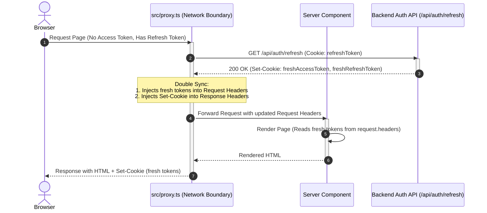
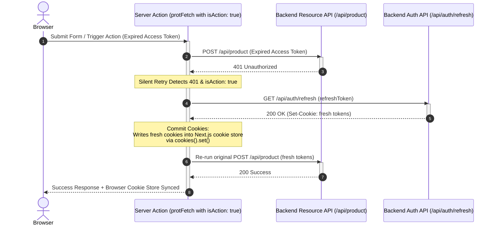
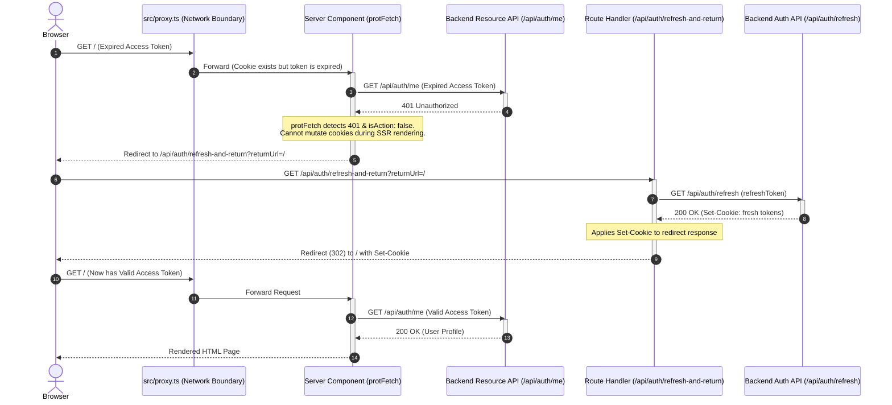
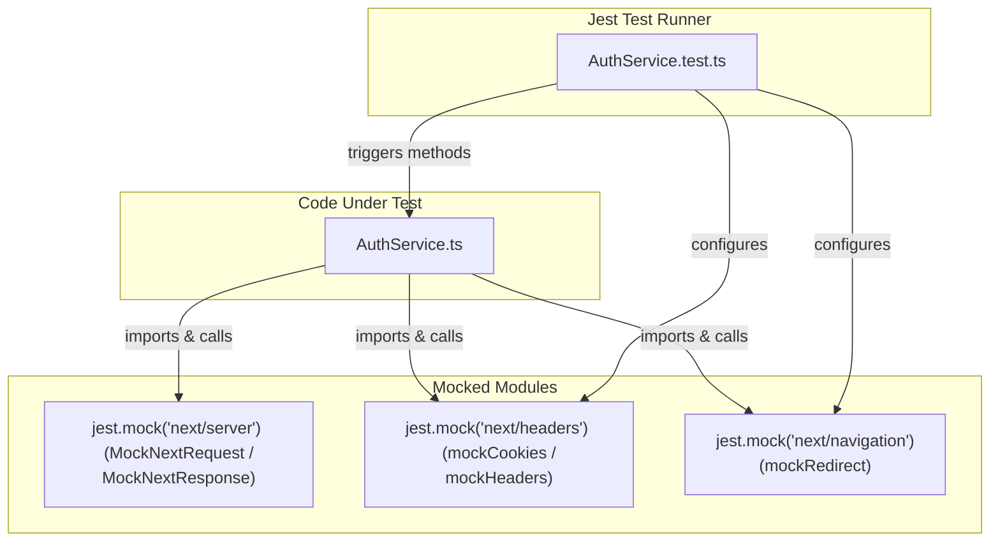

# Next.js 16 Auth SDK Engine (`@/lib/auth`)

This package is a self-contained, configuration-driven authentication SDK engineered specifically for **Next.js 16**, **Turbopack**, and **React 19**. It resolves the framework's "Cookie Write-Only" limitation in Server Components by providing a clean session management engine with proactive gateways, silent action retries, and SSR bounce recovery.

---

## 📦 Directory Structure

```
src/lib/auth/
├── index.ts                     # Barrel exporter (Public SDK API & Singleton setup)
├── AuthService.ts               # Core engine logic (Configurable class)
├── types.ts                     # Type definitions
├── README.md                    # This documentation
└── __tests__/
    ├── AuthService.test.ts      # Jest unit tests
    └── tests_documentation.md   # Detailed testing architecture doc
```

---

## 🛠️ Configuration & Initialization

To isolate the authentication SDK from concrete app implementations, the `AuthService` class is configured via a schema at initialization.

### 1. `AuthSDKConfig` Schema

Instantiate the SDK with the following configuration options:

```typescript
export interface AuthSDKConfig {
    apiUrl: string;             // The backend auth server base URL (e.g., http://localhost:4400)
    cookieNames?: {
        accessToken?: string;   // Cookie key for the access token (Default: "accessToken")
        refreshToken?: string;  // Cookie key for the refresh token (Default: "refreshToken")
    };
    routes?: {
        signOut?: string;             // Path redirected to on session expiration (Default: "/api/auth/sign-out")
        refreshAndReturn?: string;    // Bounce endpoint for SSR data-fetch refreshes (Default: "/api/auth/refresh-and-return")
    };
    timeoutMs?: number;         // Backend token rotation fetch timeout in ms (Default: 5000)
}
```

### 2. Setting Up the Singleton Instance

Create a unified entry point (typically `src/lib/auth/index.ts`) to configure and export the service. All configurations (like cookie names and routes) are imported from the global `@/config` file:

```typescript
import { AuthService as AuthServiceClass } from "./AuthService";
import { API_URL, COOKIE_NAMES, AUTH_ROUTES } from "@/config";

// Singleton AuthService configuration
export const AuthService = new AuthServiceClass({
    apiUrl: API_URL,
    cookieNames: COOKIE_NAMES,
    routes: AUTH_ROUTES,
});

// Export bound method for easy import and cleaner calls
export const protFetch = AuthService.protFetch;
```

---

## 🏗️ The Three-Layer Session Protection Architecture

Next.js 16 divides its execution environment into contexts with different cookie mutation rights:
1. **Network Boundary (`src/proxy.ts`)**: Can inspect and modify incoming request headers and outgoing response headers.
2. **Server Actions & Route Handlers**: Full read and write access to the cookie store using `cookies().set()`.
3. **Server Components (SSR Page Rendering)**: Strictly **Read-Only** context; attempting to call `cookies().set()` throws a runtime exception.

To handle these boundaries cleanly, the `AuthService` orchestrates a three-layer protection strategy:

```
┌─────────────────────────────────────────────────────────────────────────┐
│                           Incoming Request                              │
└────────────────────────────────────┬────────────────────────────────────┘
                                     │
                                     ▼
                    ┌─────────────────────────────────┐
                    │   Layer 1: Proactive Proxy      │
                    │   (Double Sync & Token Refresh) │
                    └────────────────┬────────────────┘
                                     │
                 ┌───────────────────┴───────────────────┐
                 ▼                                       ▼
       [Server Actions / Routes]                [Server Components (SSR)]
   ┌───────────────────────────────┐        ┌───────────────────────────────┐
   │     Layer 2: Silent Retry     │        │  Layer 3: Reanimator Fallback │
   │  Direct Cookie Write + Retry  │        │ Redirect-Bounce via GET Route │
   └───────────────────────────────┘        └───────────────────────────────┘
```

---

### Layer 1: Proactive Gateway (The Double Sync Pattern)

Executed in `src/proxy.ts` (network boundary). It rotates tokens before the page starts rendering if the access token has expired but a valid refresh token exists.

- **The Problem**: If the proxy rotates a token, only the outgoing response (`Set-Cookie`) gets updated. The current rendering thread (rendering the Server Components for the active request) would still read the expired/missing cookie from the original request, causing a `401 Unauthorized` during SSR.
- **The Solution (Double Sync)**: When `AuthService.getAuthorizedResponse` completes a successful refresh, it syncs the new tokens in two places:
  1. **Request Headers (`Cookie`)**: Injected directly so the current execution context (Server Components) reads the fresh tokens immediately.
  2. **Response Headers (`Set-Cookie`)**: Injected into the browser response so the client stores the new cookies for subsequent requests.

#### Double Sync Flow:


---

### Layer 2: Silent Retry (Server Actions & Route Handlers)

Executed during state mutations (such as file uploads or database updates) where a user redirect would interrupt the flow and cause permanent loss of input data.

- **The Problem**: If a token expires during a file upload in a Server Action, executing a page-level redirect aborts the HTTP connection, discarding the file payload.
- **The Solution (Direct Commit)**: When `protFetch` is called with `{ isAction: true }`, it intercepts `401 Unauthorized` errors and heals the session in place:
  1. It triggers `AuthService.refresh()` using the stored refresh token.
  2. It writes the new tokens directly to the cookie store via `cookies().set()` (which is legal inside Server Actions).
  3. It automatically re-executes the original network request using the new credentials.

#### Silent Retry Flow:


---

### Layer 3: Reanimator Fallback (Server Component Rendering Safety Net)

Acts as a fail-safe fallback during Server Component rendering (SSR) if an unauthenticated request somehow gets past the proxy layer or hits a resource-level expiration.

- **The Problem**: If a Server Component hits a `401 Unauthorized` while fetching data, it cannot call `cookies().set()` because cookie mutation is strictly forbidden during React rendering.
- **The Solution (Reanimator Route)**: The network client (`protFetch`) throws a redirect to `/api/auth/refresh-and-return?returnUrl=[CurrentURL]`:
  1. The route handler `/api/auth/refresh-and-return` is a GET endpoint (where cookie mutations *are* legal).
  2. It performs the token rotation and commits the updated cookies using `NextResponse`.
  3. It bounces (redirects) the browser back to the origin `returnUrl`, where the page renders successfully on the second try.

#### Reanimator Fallback Flow:


---

## 🛑 Cookie Synchronization Pitfalls Solved

During development, we resolved four major pitfalls common to Next.js authentication architectures:

1. **The "Half-Sync" Failure**: Triggering a refresh inside the proxy updates the browser (`Set-Cookie` in response), but fails to update the request headers. The immediately following React rendering cycle reads the expired cookies from the incoming request, triggering a 401 error. *Fixed in Layer 1 via Double Sync.*
2. **The Swallowed Redirect**: Surrounding Server Actions with blind `try/catch` blocks intercepts Next.js's internal routing signals. Since `redirect()` works by throwing a special `NEXT_REDIRECT` error, swallowing it prevents the router from navigating. *Fixed by checking `if (e?.digest?.startsWith('NEXT_REDIRECT')) throw e;` in catch blocks.*
3. **The Refresh Storm**: Concurrent requests hitting an expired session at the same time can cause a race condition, where multiple calls attempt to rotate the same refresh token concurrently. The first rotation invalidates the old token, causing subsequent calls to fail. *Fixed by handling de-duplication on the backend side.*
4. **The Action Interruption**: Triggering a standard browser redirect during a `POST` file upload interrupts the upload, causing loss of form state. *Fixed in Layer 2 by running an in-place fetch retry, bypassing redirects entirely.*

---

## 🔗 Client Component Support (Server Actions Pattern)

Because authentication cookies are marked `HttpOnly` for security, Client Components (`"use client"`) cannot access token strings directly or mutate cookie values.

To execute data mutations or upload files from Client Components safely without redirects or session-related data loss, they trigger Server Actions (`"use server"`). These actions run on the server side where calling `protFetch` with `isAction: true` allows in-place session refresh and automatic request retries:

1. **Define a Server Action** (e.g., `src/app/(home)/actions.ts`):
```typescript
"use server";

import { protFetch } from "@/lib/auth";

export async function uploadImagesAction(_prevState: unknown, formData: FormData) {
    try {
        const res = await protFetch("/api/product", {
            method: "POST",
            body: formData,
            isAction: true,
        });

        if (!res.ok) {
            return { error: "Failed to upload images" };
        }

        const data = await res.json();
        return { success: true, data };
    } catch (e) {
        // Ensure Next.js internal redirect exceptions are propagated
        if (e && typeof e === "object" && "digest" in e && typeof (e as { digest: string }).digest === "string") {
            if ((e as { digest: string }).digest.startsWith("NEXT_REDIRECT")) throw e;
        }
        return { error: "Internal server error" };
    }
}
```

2. **Invoke from a Client Component** (e.g., `src/components/Forms/ImageUploadForm.tsx`):
```tsx
"use client";

import { useActionState } from "react";
import { uploadImagesAction } from "@/app/(home)/actions";

export default function ImageUploadForm() {
    const [state, action, isPending] = useActionState(uploadImagesAction, null);

    return (
        <form action={action}>
            <input type="file" name="images" multiple />
            <button type="submit" disabled={isPending}>
                {isPending ? "Uploading..." : "Submit"}
            </button>
            {state?.error && <p style={{ color: "red" }}>{state.error}</p>}
        </form>
    );
}
```

---

## 🎨 Diagnostic Logs Reference

The SDK includes a color-coded logging system built with ANSI codes to simplify debugging. In the terminal, look for the following prefixes:

| Prefix | Color | Context | Meaning |
| :--- | :--- | :--- | :--- |
| `Proxy` | **Yellow** | `src/proxy.ts` | Tracks entry, public/private route validation, and routing decisions. |
| `AuthService [AUTH]` | **Green** | `AuthService` | Logged during Double Sync, cookie commits, and proxy validation. |
| `AuthService [FETCH-START]` | **Green** | `AuthService.protFetch` | Logged when a resource request is initiated. Shows the request path and parameters. |
| `AuthService [FETCH-AUTH]` | **Green** | `AuthService.protFetch` | Logged when an in-action token rotation succeeds and retries the call. |
| `AuthService [FETCH-ERROR]` | **Green** | `AuthService.protFetch` | Logged when a request fails with 401 and begins a recovery attempt or redirect. |
| `AuthService [FETCH-FINISH]` | **Green** | `AuthService.protFetch` | Logged upon successful completion of a fetch request, showing HTTP status. |
| `AuthService [REFRESH-START]` | **Green** | `AuthService.refresh` | Logged when the low-level fetch request to the rotation backend begins. |
| `AuthService [REFRESH-ERROR]` | **Green** | `AuthService.refresh` | Logged when the token rotation fails (e.g., timeout, abort, or 401 response). |
| `AuthService [REFRESH-FINISH]` | **Green** | `AuthService.refresh` | Logged when token rotation succeeds, confirming receipt of raw cookies. |
| `AuthService [REANIMATOR-START]` | **Green** | `AuthService.handleRefreshAndReturn` | Logged when the fallback redirect bounce endpoint is hit. |
| `AuthService [REANIMATOR-FINISH]` | **Green** | `AuthService.handleRefreshAndReturn` | Logged when the fallback endpoint completes rotation and redirects back. |
| `AuthService [REANIMATOR-ERROR]` | **Green** | `AuthService.handleRefreshAndReturn` | Logged when the fallback endpoint fails to rotate tokens and forces a logout. |
| `SignInAction` | **Magenta** | `src/app/sign-in/actions.ts` | Tracks credentials validation and initial session commits. |
| `SignOut` | **Red** | `src/app/api/auth/sign-out/route.ts` | Tracks session destruction and redirect to the sign-in page. |

---

## ⚙️ Core Public API Methods

### `getAuthorizedResponse(req: NextRequest)`
- **Execution Context**: Network boundary (`src/proxy.ts`).
- **Purpose**: Checks the incoming request's tokens. If the access token is missing or expired, but the refresh token is present, it calls the backend refresh endpoint, updates request headers (Double Sync), and appends `Set-Cookie` headers to the response. Also injects the `x-url` header containing the requested URL to facilitate page restoration.
- **Signature**:
  ```typescript
  interface AuthService {
      getAuthorizedResponse(req: NextRequest): Promise<{ response: NextResponse, isRefreshed: boolean }>;
  }
  ```
- **Returns**: A promise resolving to the next `NextResponse` (containing request modifications) and an `isRefreshed` boolean indicator.

---

### `protFetch<TBody = unknown>(path: string, options?: RequestInit)`
- **Execution Context**: Server Components (SSR), Server Actions, or Route Handlers.
- **Purpose**: A fetch client wrapper that handles secure requests. If a request returns `401 Unauthorized`, it attempts recovery based on the context:
  - If `isAction` is `true` (Server Action or Route Handler): Executes in-place token rotation, commits new cookies to the Next.js cookie store via `cookies().set()`, and retries the original request.
  - If `isAction` is `false` (Server Component): Throws a Next.js `redirect()` exception pointing to the Reanimator route.
- **Signature**:
  ```typescript
  interface AuthService {
      protFetch<TBody = unknown>(
          path: string,
          options?: Omit<RequestInit, "body"> & { body?: TBody, isAction?: boolean }
      ): Promise<Response>;
  }
  ```
- **Exceptions**: Can throw a Next.js redirect error (which must be allowed to propagate up to the Next.js router engine).

---

### `handleRefreshAndReturn(req: NextRequest)`
- **Execution Context**: GET Route Handler at `/api/auth/refresh-and-return`.
- **Purpose**: Acts as the Reanimator landing page. It reads the return URL from search parameters, initiates low-level token rotation, appends the fresh `Set-Cookie` tokens to the redirection, and redirects back to the original page.
- **Signature**:
  ```typescript
  interface AuthService {
      handleRefreshAndReturn(req: NextRequest): Promise<NextResponse>;
  }
  ```

---

### `commitCookies(rawSetCookies: string[])`
- **Execution Context**: Server Actions or Route Handlers (such as Sign-In processing).
- **Purpose**: Takes a list of raw `Set-Cookie` strings returned by the backend auth API, parses them individually, and writes them into the Next.js cookie store using the `cookies().set()` API.
- **Signature**:
  ```typescript
  interface AuthService {
      commitCookies(rawSetCookies: string[]): Promise<void>;
  }
  ```

---

### `parseSetCookie(setCookie: string)`
- **Execution Context**: Internal utilities / Low-level parser.
- **Purpose**: Decodes a single raw `Set-Cookie` string header into a structured configuration object.
- **Supported Fields**: `Domain`, `Expires` (dates), `HttpOnly`, `Max-Age`, `Path`, `SameSite` (lax/strict/none normalization), `Secure`, `Priority` (low/medium/high normalization), `Partitioned`.
- **Edge Case (Max-Age=0)**: Explicitly parses empty values (e.g. `accessToken=; Max-Age=0`) to preserve empty strings `""` instead of omitting them, ensuring session deletions are committed properly.
- **Signature**:
  ```typescript
  interface AuthService {
      parseSetCookie(setCookie: string): ParsedCookie | undefined;
  }
  ```

---

## 🧪 Low-Level Token Rotation (`refresh`)

The low-level refresh handler calls the backend authentication endpoint (`/api/auth/refresh`) using the HTTP `Cookie` header. It wraps the execution with an `AbortSignal.timeout` to prevent connection hangs.

```typescript
interface AuthService {
    refresh(refreshToken: string, logPath?: string): Promise<RefreshResponse>;
}
```

- **Successful Response**: Returns `{ success: true, cookieString: string, rawSetCookies: string[] }`.
- **Failed Response**: Returns `{ success: false }` indicating the session refresh failed.

---

## 🧪 Unit Testing Strategy

The SDK features a comprehensive unit test suite with **21 test cases** checking all core functions.

The tests run on **Jest** and utilize Jest's module-level mocking capabilities to mock Next.js server-side modules (`next/headers`, `next/navigation`, `next/server`) in complete isolation.

### Mocking Architecture



### Test Sections Summary
The 21 unit tests are organized into 5 functional sections in [./__tests__/AuthService.test.ts](./__tests__/AuthService.test.ts):

1. **1. Cookie Parser & Commit**
   - *1.1 Parse standard attributes*: Verifies extraction of standard fields (Domain, Secure, etc.).
   - *1.2 Parse empty values*: Validates that deletion cookies (Max-Age=0) are preserved as `""`.
   - *1.3 Case normalization*: Validates that keys like `SameSite=STRICT` are normalized to lowercase.
   - *1.4 commitCookies*: Asserts correct parsing and writing into the mock cookie store.

2. **2. Low-Level Token Refresh**
   - *2.1 Success 200 OK*: Verifies backend request creation and header mapping.
   - *2.2 200 OK with no cookies*: Asserts fallback redirection on empty backend responses.
   - *2.3 Rejection (401/500)*: Asserts direct forwarding to the logout route.
   - *2.4 Timeout/Abort*: Verifies safe catch-and-fail behavior on connection aborts.

3. **3. Proxy Gateway**
   - *3.1 Access Token Present*: Requests bypass with `NextResponse.next()`.
   - *3.2 Missing tokens*: Requests bypass (enabling app-level public route fallback).
   - *3.3 Double Sync success*: Validates cookie injections in both Request and Response.
   - *3.4 Refresh failure*: Confirms immediate redirection to logout.
   - *3.5 x-url Header Injection*: Asserts that `getAuthorizedResponse` injects the `x-url` header.

4. **4. Smart HTTP Client / Silent Retry**
   - *4.1 Normal 200 response*: Unmodified bypass.
   - *4.2 Silent Action retry (Success)*: Verifies automatic recovery, cookie commit, and request re-run.
   - *4.3 Silent Action retry (Failure)*: Verifies immediate logout redirection.
   - *4.4 Reanimator Redirect*: Asserts throwing stateful redirect error inside page render contexts.
   - *4.5 Immediate Sign-out*: Bypasses refresh call if no refresh token exists in store.

5. **5. Reanimator Handler**
   - *5.1 Bounce success*: Verifies redirection back to return URL with fresh cookies.
   - *5.2 Bounce failure*: Redirects to logout.
   - *5.3 Missing token bounce*: Immediately redirects to logout.

For more details on the testing setup and logging formatting, refer to the [Testing Documentation](./__tests__/tests_documentation.md).

Run the test suite with:
```bash
npm run test
```
