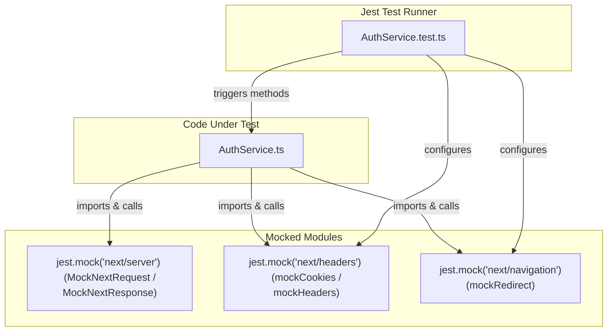

# Next.js 16 Auth SDK Engine (`@/lib`)

This package is a self-contained, configuration-driven authentication SDK engineered specifically for **Next.js 16**, **Turbopack**, and **React 19**. It resolves the framework's "Cookie Write-Only" limitation in Server Components by providing a clean session management engine with proactive gateways, silent action retries, and SSR bounce recovery.

---

## 📦 Directory Structure

```
src/lib/auth/
├── index.ts                     # Barrel exporter (Public SDK API & Singleton setup)
├── AuthService.ts               # Core engine logic (Configurable class)
├── types.ts                     # Type definitions
├── README.md                    # This documentation
└── __tests__/
    ├── AuthService.test.ts      # Jest unit tests
    └── tests_documentation.md   # Detailed testing architecture doc
```

---

## 🛠️ Configuration & Initialization

To isolate the authentication SDK from concrete app implementations, the `AuthService` class is configured via a schema at initialization.

### 1. `AuthSDKConfig` Schema

Instantiate the SDK with the following configuration options:

```typescript
export interface AuthSDKConfig {
    apiUrl: string;             // The backend auth server base URL (e.g., http://localhost:4400)
    cookieNames?: {
        accessToken?: string;   // Cookie key for the access token (Default: "accessToken")
        refreshToken?: string;  // Cookie key for the refresh token (Default: "refreshToken")
    };
    routes?: {
        signOut?: string;             // Path redirected to on session expiration (Default: "/api/auth/sign-out")
        refreshAndReturn?: string;    // Bounce endpoint for SSR data-fetch refreshes (Default: "/api/auth/refresh-and-return")
    };
    timeoutMs?: number;         // Backend token rotation fetch timeout in ms (Default: 5000)
}
```

### 2. Setting Up the Singleton Instance

Create a unified entry point (typically `src/lib/auth/index.ts`) to configure and export the service. All configurations (like cookie names and routes) are imported from the global `@/config` file:

```typescript
import { AuthService as AuthServiceClass } from "./AuthService";
import { API_URL, COOKIE_NAMES, AUTH_ROUTES } from "@/config";

// Singleton AuthService configuration
export const AuthService = new AuthServiceClass({
    apiUrl: API_URL,
    cookieNames: COOKIE_NAMES,
    routes: AUTH_ROUTES,
});

// Export bound method for easy import and cleaner calls
export const protFetch = AuthService.protFetch;

export type { ParsedCookie, AuthSDKConfig, RefreshResponse } from "./types";
export { AuthServiceClass };
```

---

## ⚙️ Core Public API Methods

### `getAuthorizedResponse(req: NextRequest)`
- **Execution Context**: Next.js Proxy boundary (`src/proxy.ts`).
- **Purpose**: Checks the incoming request's tokens. If the access token is missing or expired, but the refresh token is present, it calls the backend refresh endpoint, updates request headers (Double Sync), and appends `Set-Cookie` headers to the response. It also injects the `x-url` header containing the requested URL to facilitate page restoration.
- **Signature**:
  ```typescript
  async getAuthorizedResponse(req: NextRequest): Promise<{ response: NextResponse, isRefreshed: boolean }>
  ```
- **Returns**: A promise resolving to the next `NextResponse` (containing request modifications) and an `isRefreshed` boolean indicator.

---

### `protFetch<TBody = unknown>(path: string, options?: RequestInit)`
- **Execution Context**: Server Components (SSR), Server Actions, or Route Handlers.
- **Purpose**: A fetch client wrapper that handles secure requests. If a request returns `401 Unauthorized`, it attempts recovery based on the context:
  - If `isAction` is `true` (Server Action or Route Handler): Executes in-place token rotation, commits new cookies to the Next.js cookie store via `cookies().set()`, and retries the original request.
  - If `isAction` is `false` (Server Component): Throws a Next.js `redirect()` exception pointing to the Reanimator route.
- **Signature**:
  ```typescript
  async protFetch<TBody = unknown>(
      path: string,
      options: Omit<RequestInit, "body"> & { body?: TBody, isAction?: boolean } = {}
  ): Promise<Response>
  ```
- **Exceptions**: Can throw a Next.js redirect error (which must be allowed to propagate up to the Next.js router engine).

---

### `handleRefreshAndReturn(req: NextRequest)`
- **Execution Context**: GET Route Handler at `/api/auth/refresh-and-return`.
- **Purpose**: Acts as the Reanimator landing page. It reads the return URL from search parameters, initiates low-level token rotation, appends the fresh `Set-Cookie` tokens to the redirection, and redirects back to the original page.
- **Signature**:
  ```typescript
  async handleRefreshAndReturn(req: NextRequest): Promise<NextResponse>
  ```

---

### `commitCookies(rawSetCookies: string[])`
- **Execution Context**: Server Actions or Route Handlers (such as Sign-In processing).
- **Purpose**: Takes a list of raw `Set-Cookie` strings returned by the backend auth API, parses them individually, and writes them into the Next.js cookie store using the `cookies().set()` API.
- **Signature**:
  ```typescript
  async commitCookies(rawSetCookies: string[]): Promise<void>
  ```

---

### `parseSetCookie(setCookie: string)`
- **Execution Context**: Internal utilities / Low-level parser.
- **Purpose**: Decodes a single raw `Set-Cookie` string header into a structured configuration object.
- **Supported Fields**: `Domain`, `Expires` (dates), `HttpOnly`, `Max-Age`, `Path`, `SameSite` (lax/strict/none normalization), `Secure`, `Priority` (low/medium/high normalization), `Partitioned`.
- **Edge Case (Max-Age=0)**: Explicitly parses empty values (e.g. `accessToken=; Max-Age=0`) to preserve empty strings `""` instead of omitting them, ensuring session deletions are committed properly.
- **Signature**:
  ```typescript
  parseSetCookie(setCookie: string): ParsedCookie | undefined
  ```

---

## 🧪 Low-Level Token Rotation (`refresh`)

The low-level refresh handler calls the backend authentication endpoint (`/api/auth/refresh`) using the HTTP `Cookie` header. It wraps the execution with an `AbortSignal.timeout` to prevent connection hangs.

```typescript
async refresh(refreshToken: string, logPath: string = ''): Promise<RefreshResponse>
```

- **Successful Response**: Returns `{ success: true, cookieString: string, rawSetCookies: string[] }`.
- **Failed Response**: Returns `{ success: false }` indicating the session refresh failed.

---

## 🧪 Unit Testing Strategy

The SDK features a comprehensive unit test suite with **21 test cases** checking all core functions. 

The tests run on **Jest** and utilize Jest's module-level mocking capabilities to mock Next.js server-side modules (`next/headers`, `next/navigation`, `next/server`) in complete isolation.

### Mocking Architecture



### Test Sections Summary
The 21 unit tests are organized into 5 functional sections in [AuthService.test.ts](file:///C:/Users/arays/Documents/Projects/next-0/src/lib/auth/__tests__/AuthService.test.ts):

1. **1. Cookie Parser & Commit**
   - *1.1 Parse standard attributes*: Verifies extraction of standard fields (Domain, Secure, etc.).
   - *1.2 Parse empty values*: Validates that deletion cookies (Max-Age=0) are preserved as `""`.
   - *1.3 Case normalization*: Validates that keys like `SameSite=STRICT` are normalized to lowercase.
   - *1.4 commitCookies*: Asserts correct parsing and writing into the mock cookie store.

2. **2. Low-Level Token Refresh**
   - *2.1 Success 200 OK*: Verifies backend request creation and header mapping.
   - *2.2 200 OK with no cookies*: Asserts fallback redirection on empty backend responses.
   - *2.3 Rejection (401/500)*: Asserts direct forwarding to the logout route.
   - *2.4 Timeout/Abort*: Verifies safe catch-and-fail behavior on connection aborts.

3. **3. Middleware Gateway**
   - *3.1 Access Token Present*: Requests bypass with `NextResponse.next()`.
   - *3.2 Missing tokens*: Requests bypass (enabling app-level public route fallback).
   - *3.3 Double Sync success*: Validates cookie injections in both Request and Response.
   - *3.4 Refresh failure*: Confirms immediate redirection to logout.
   - *3.5 x-url Header Injection*: Asserts that `getAuthorizedResponse` injects the `x-url` header containing the current requested URL.

4. **4. Smart HTTP Client / Silent Retry**
   - *4.1 Normal 200 response*: Unmodified bypass.
   - *4.2 Silent Action retry (Success)*: Verifies automatic recovery, cookie commit, and request re-run.
   - *4.3 Silent Action retry (Failure)*: Verifies immediate logout redirection.
   - *4.4 Reanimator Redirect*: Asserts throwing stateful redirect error inside page render contexts.
   - *4.5 Immediate Sign-out*: Bypasses refresh call if no refresh token exists in store.

5. **5. Reanimator Handler**
   - *5.1 Bounce success*: Verifies redirection back to return URL with fresh cookies.
   - *5.2 Bounce failure*: Redirects to logout.
   - *5.3 Missing token bounce*: Immediately redirects to logout.

For more details on the testing setup and logging formatting, refer to the [Testing Documentation](file:///C:/Users/arays/Documents/Projects/next-0/src/lib/auth/__tests__/tests_documentation.md).

Run the test suite with:
```bash
npm run test
```
